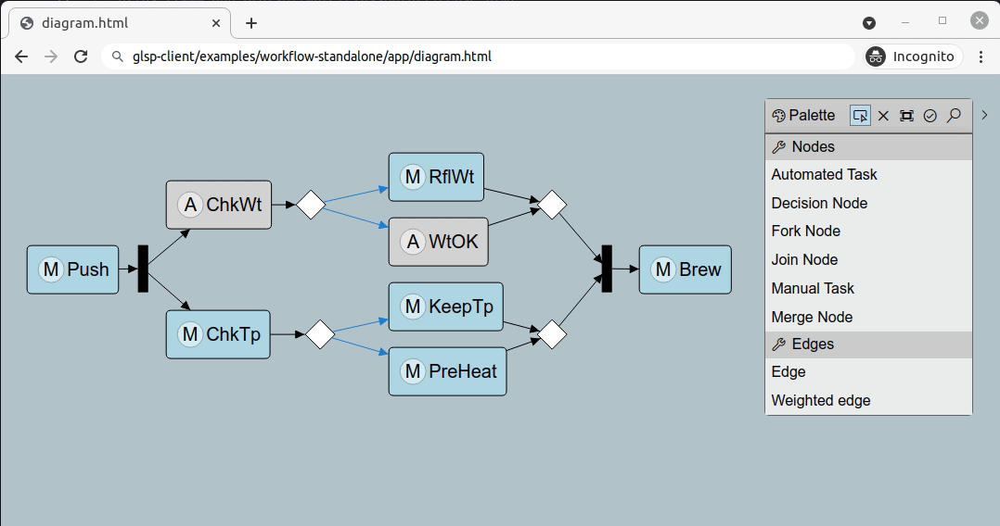

# glsp-workflow-example

This is a modeling example based on the [Graphical Language Server Platform](https://github.com/eclipse-glsp/glsp). You can use this project as a template to start with your own modeling project.

## Overview

A GLSP diagram editor implementation typically consists of three parts:

 - Client based  e.g. [glsp-workflow-example-client](glsp-workflow-example-client/README.md)
 - Server based on glsp-server, e.g. [glsp-workflow-example-server](glsp-workflow-example-server/README.md)
 - Platform integration: Eclipse Theia, VSCode, Eclipse RCP, e.g. [glsp-workflow-example-web](glsp-workflow-example-web/README.md)

If you want to support multiple platforms, you only need to provide multiple implementations of the platform integrations. All other parts are the same for every platform. The platform integration takes care of things like the editor registration for a specific file type, platform-specific styling and potentially theming support (VSCode and Theia), native menus, integration with the platforms Problems View, etc. Thus, they only contain the things that are really specific to the platform.

The platform-independent things, such as the diagram logic (server) and the diagram rendering & UI (client) remain the same across all platforms.

HTML5 Web Example:

