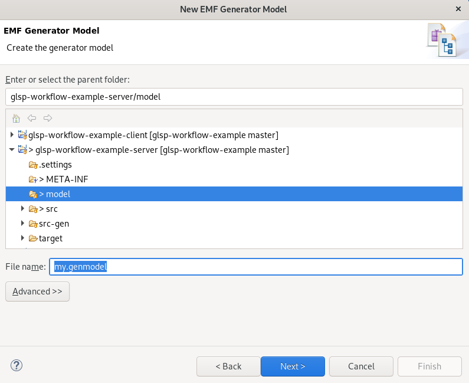
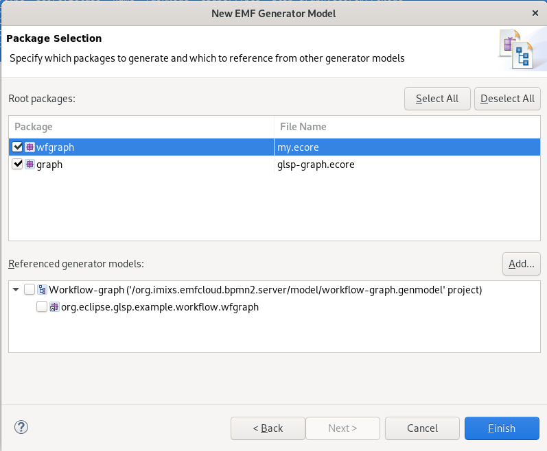
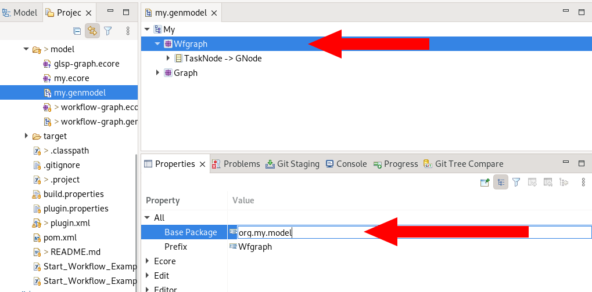
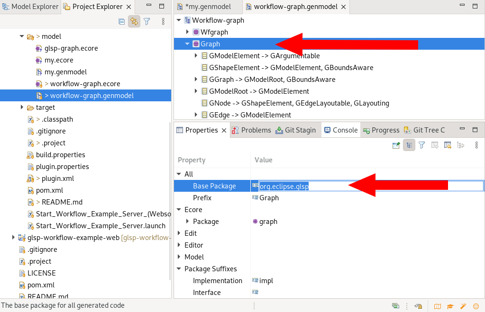

# glsp-workflow-example-server

This module contains the server implementation of the glsp-workflow-example. The server implementation is based on the [Eclipse gls-server project](https://github.com/eclipse-glsp/glsp-server). The example implementation can be used for different target platforms (HTML5, Eclipse Theia, VSCode, Eclipse RCP).

## Building the Workflow Diagram example server

To build the server run 

	$ mvn clean verify -Pm2 -Pfatjar

This will generate a sever jar including your EMF model and all necessary components. This is called a 'fatjar'. 

From the /target/ folder you can now start the server by executing the following commands (whereas X.X.X is the current version):

	$ cd target
	$ java -jar glsp-workflow-example-server-X.X.X-SNAPSHOT-glsp.jar org.eclipse.glsp.example.workflow.launch.ExampleServerLauncher

For the HTML5 client you need to run the server on port 8081

	$ java -jar glsp-workflow-example-server-X.X.X-SNAPSHOT-glsp.jar org.eclipse.glsp.example.workflow.launch.ExampleServerLauncher --port=8081 --websocket

To start the example server from within your IDE, run the main method of the class `WorkflowServerLauncher.java` in the module `org.eclipse.glsp.example.workflow.launch` 

Once the server is running, choose a diagram client integration (such as Eclipse Theia, VSCode, Eclipse, or Standalone).

## Bring Your Own Model: Extending GLSP using an external EMF model 

If you start you own modeling Tool, you first need to define your custom EMF model. You can use the [Eclipse Modeling Framework](https://www.eclipse.org/modeling/emf/) to extend the GLSP model schema. Eclipse will create the necessary java classes out of the model description. To create the model follow these steps:

 - Create a new EMF Model file `.ecore`
 - Generate a `.genmodel` file
 - Generate Java Classes based on your genmodel file

### Create a new EMF model

So in the beginning you need in to create a new EMF model file:

 - Create a new Folder in your plugin project named *model*
 - copy the file 'glsp-graph.ecore' into the *model* folder. (the file can be loaded from [here](https://github.com/rsoika/glsp-workflow-example/tree/master/glsp-workflow-example-server/model))
 - add a new Ecore Model file in the new model folder – e.g. ‘mymodel.ecore’

In EMF Model File you typically extend the GLSP super types. See the following example defining a 'Task' element

	<?xml version="1.0" encoding="UTF-8"?>
	<ecore:EPackage xmi:version="2.0" xmlns:xmi="http://www.omg.org/XMI" xmlns:xsi="http://www.w3.org/2001/XMLSchema-instance"
	    xmlns:ecore="http://www.eclipse.org/emf/2002/Ecore" name="wfgraph" nsURI="http://www.eclipse.org/glsp/examples/workflow/graph"
	    nsPrefix="wfgraph">
	  <eClassifiers xsi:type="ecore:EClass" name="TaskNode" eSuperTypes="glsp-graph.ecore#//GNode">
	    <eStructuralFeatures xsi:type="ecore:EAttribute" name="nodeType" eType="ecore:EDataType http://www.eclipse.org/emf/2002/Ecore#//EString"/>
	    <eStructuralFeatures xsi:type="ecore:EAttribute" name="name" eType="ecore:EDataType http://www.eclipse.org/emf/2002/Ecore#//EString"/>
	    <eStructuralFeatures xsi:type="ecore:EAttribute" name="taskType" eType="ecore:EDataType http://www.eclipse.org/emf/2002/Ecore#//EString"/>
	    <eStructuralFeatures xsi:type="ecore:EAttribute" name="reference" eType="ecore:EDataType http://www.eclipse.org/emf/2002/Ecore#//EString"/>
	  </eClassifiers>
	</ecore:EPackage>

**Note:** Change the name, nsURI and nsPrefix to the naming in your own project. 

### Create a .genmodel file

When the EMF file is defined you can create the genmodel file. Choose from the Eclipse IDE context menu of the .ecore file:

‘New->Other->EMF Generator Model’

and create a new file ‘mymodel.genmodel’. Choose the importer ‘ecoremodel’. 

Click on load will verify the EMF model file created before.

Next select both packages in the 'Package Selection' (the glsp-graph package includes the core elements form the GLSP project)

Click on 'Finish' to generate the *.genmodel* file.

### Generate java classes

Now you can generate the java classes. Before you can start, you need to change some of the details of the new *.genfile*.  Open the *.genfile* and choose the root element of your model. In the property view change the package name to your corresponding java package where the generated classes should be placed in:

Next choose the root element of you glsp graph model. In the property view change the package name to `org.eclipse.glsp`. 

Click on the root element of the genfile and choose ‘Generate Model Code’. This will create the class files in the predefined package. 

Finally you can now generate the code of your model. Select again only the root element of your model and Choose *Generate Model Code*. This will now generate all necessary classes referencing the GLSP core model types. 

